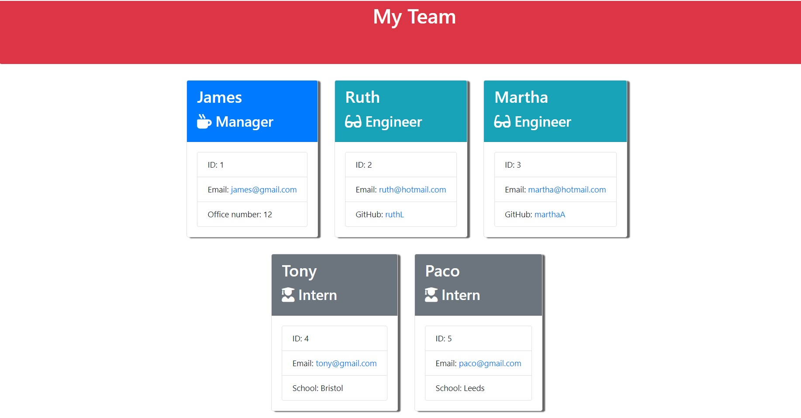

# Team-Profile-Generator
## Description
Worrking Node.js command-line application that take in information about employees on a software engineering team and generates an HTML webpage that displays summaries for each person.

##  Table of Content
- [Project description](#description)
- [Installation](#installation)
- [Usage](#usage)
- [Constributing](#contributing)
- [Test](#test)
- [Questions](#questions)

  
## Installation
  npm install inquirer is required.

## Usage
When you run node index.js, the application uses the inquirer package to prompt you in the command line with a series of questions. First, you have to write information about the manager and then you can choose more emplyees as ingeneer or intern, or just stop building the team.

The application will start by running `node index.js`

https://user-images.githubusercontent.com/100029887/220200044-7c878f2a-431a-4431-a374-d859302264c0.mp4

You can watch the video here:

Appliction screenshot:

## Constributing
  Antonio Algaba Osuna

## Test 
  Not aplicable.

## Questions

Reach out on GitHub:

- Github: [@AntonioAlgaba](https://github.com/AntonioAlgaba)
  
  
